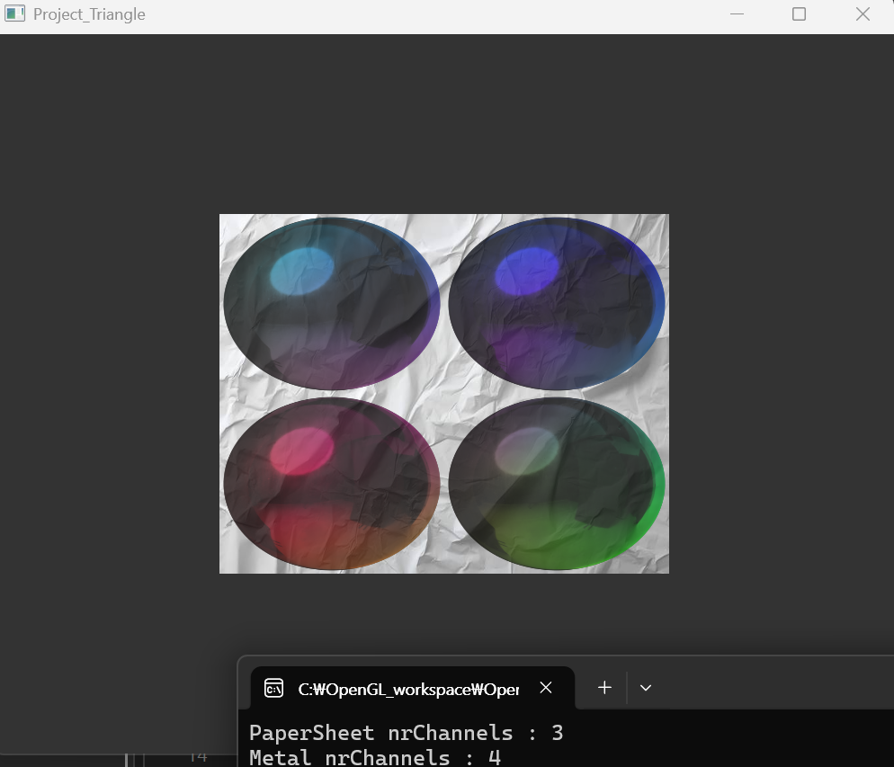
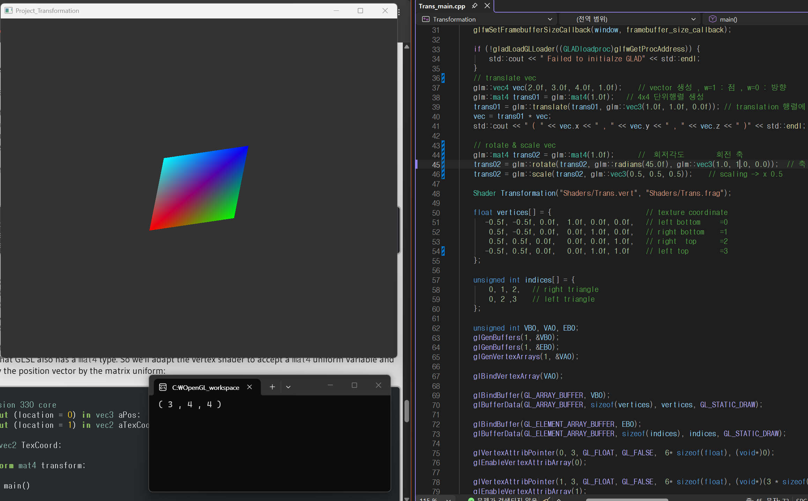
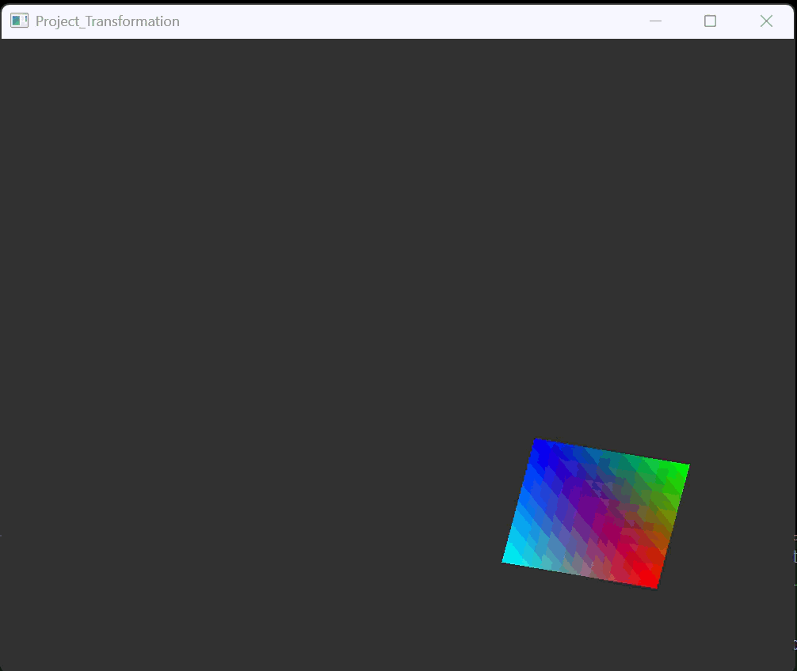
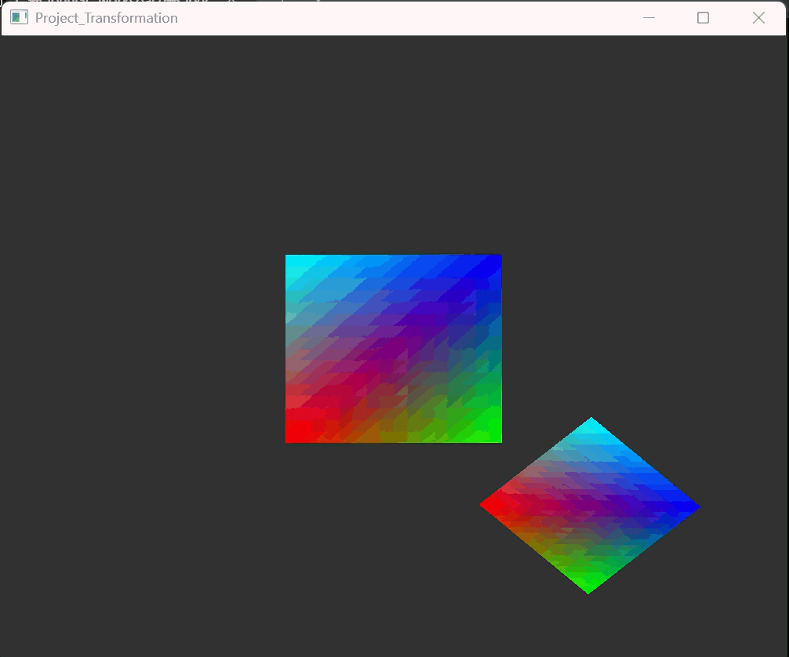
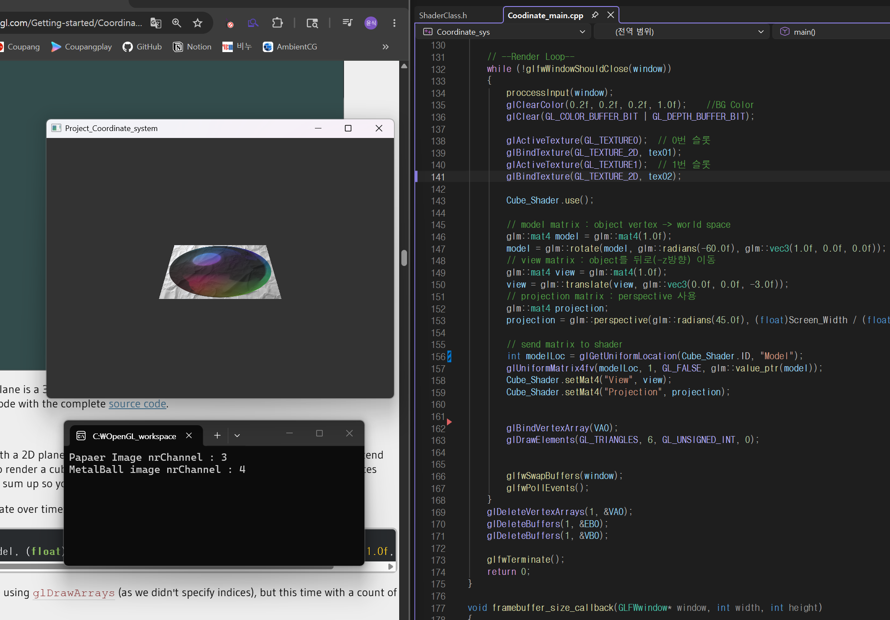
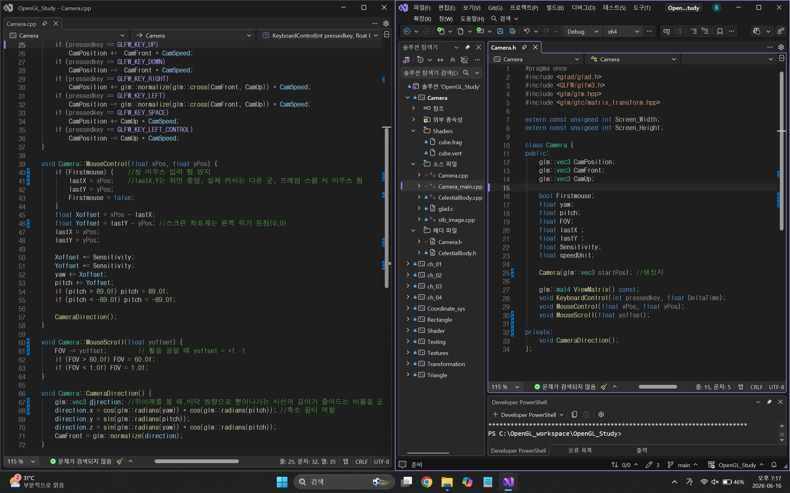
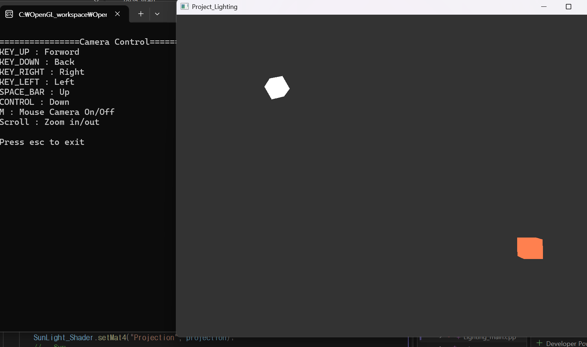
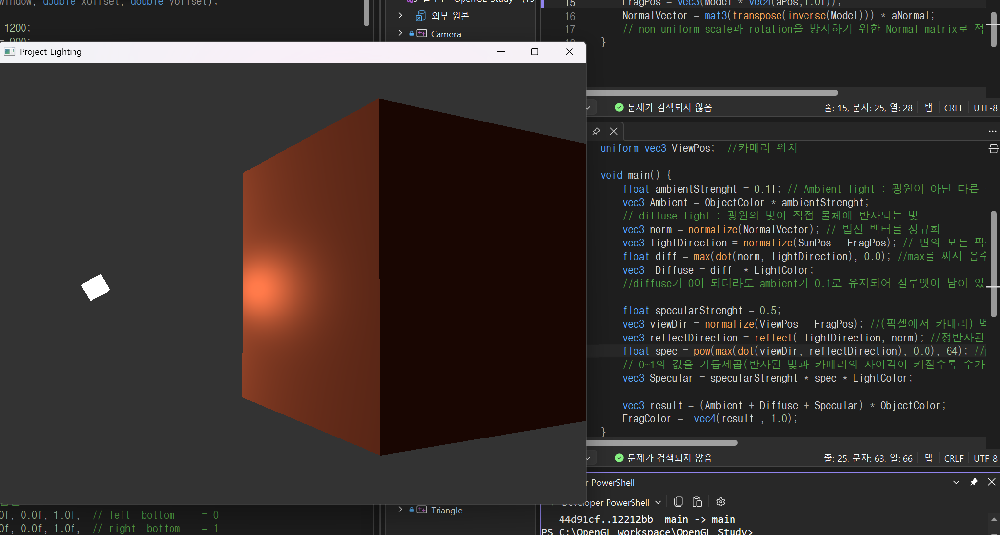

# 🎮 OpenGL Rendering Project

C++와 OpenGL을 사용하여 그래픽스 렌더링의 기초를 다지는 프로젝트 및 학습.
외부 설정 없이 바로 빌드하여 실행할 수 있도록 정적 라이브러리 구조로 설계.
* Vertex Data -> Buffer -> Shader -> Draw

## 🪜 학습 루트
1. 기본 렌더링
2. Shader + Color
3. Texture
4. Transform
5. Coordinate system
6. Camera
7. Lighting
8. Model Loading
9. Advanced OpenGL
   - Depth testing
   - Stencil testing
   - Blending
   - Framebuffers

## 📺 실행 화면

| 프로젝트명 | 실행 결과 | 설명 |
| :--- | :---: | :--- |
| **01. Testing** |  | 프로젝트 설정 및 라이브러리 로드 테스트, OpenGL Window 생성 |

<b> Ch 2 . 기본 렌더링 및 도형 출력 </b>

 
  
| 프로젝트명 | 실행 결과 | 설명 |
| :--- | :---: | :--- |
| **02. Triangle** |  | 기본적인 VAO/VBO를 이용한 삼각형 렌더링 (EBO X) |
| **02-1. Rectangle** |  | 기본적인 VAO/VBO/EBO를 이용한 사각형 렌더링 |
| **02-2. Wireframe Mode** |  | glPolygonMode를 사용한 Wireframe Mode |

<b> Ch 3 . Shaders </b>

 

| 프로젝트명 | 실행 결과 | 설명 |
| :--- | :---: | :--- |
| **03. Shader_GLSL** |  | GLSL에서 in&out을 사용해 shader에서 shader로 데이터 전달  |
| **03-1. Shader_uniform** |  | GLSL에서 uniform을 사용해 GPU shader로 데이터 전달 & 삼각형의 밝기 조절  |
| **03-2. Shader_vertices+edgecolor** |  | vertices Data에 color값을 넣고 각 모서리를 서로 다른 색 표현 / GLSL 분리  |

<b> Ch 4. Texture 렌더링  </b>

 

| 프로젝트명 | 실행 결과 | 설명 |
| :--- | :---: | :--- |
| **04. Texture** |  | 사각형에 Texture 입히기 & Mipmap, Filtering ,Blend로 투명화 |
| **04-1. Tex_Mix** |  | Blend 대신 Mix로 사각형에 Texture 2개 입히기  |
| **04-2. Mix_independent** |  |  Textrue 2개를 독립적으로 mix, 한개는 좌표를 2배+Color, 각 이미지의 nrChannel 확인 |

<b> Ch 5. Transformation  </b>
   

 

| 프로젝트명 | 실행 결과 | 설명 |
| :--- | :---: | :--- |
| **05. Transformation** |  | 렌더링된 사각형을 glm을 이용해 rotate |
| **05-1. Trans_rotateing** |  | 사각형을 translate+scale+rotateing |
| **05-2. Trans_Orbit** |  | translate한 사각형을 공전(orbit) |
| **05-3. Orbit with depth** | <video src="https://github.com/user-attachments/assets/https://github.com/user-attachments/assets/83e75564-c5e7-4ba1-96e8-79d2d8336695" autoplay loop muted playsinline controls width="250"></video> | 사각형을 깊이감 있게 공전(orbit) 및 수평 유지 자전 구현 |

<b> Ch 6. Coordinate System | Going 3D  </b>
   

 

| 프로젝트명 | 실행 결과 | 설명 |
| :--- | :---: | :--- |
| **06. Coordinate system** |  | model,view,projection(perspective)을 이용한 3D : -z방향으로 기울이기 |
| **06-1. Rotating Cube** | <video src="https://github.com/user-attachments/assets/https://github.com/user-attachments/assets/ae3bec5a-2b09-4aaa-b186-8c909de0f18d" autoplay loop muted playsinline controls width="250"></video> | 24개의 정점+색+텍스쳐 좌표를 렌더링한 큐브 |
| **06-2. Orbit Cube** | <video src="https://github.com/user-attachments/assets/https://github.com/user-attachments/assets/41ea6143-bb2b-4b73-89cd-33df6c6b47c2" autoplay loop muted playsinline controls width="250"></video> | 태양을 중심으로 transformation을 이용한 Orbit |
| **06-3. Sun-Earth-Moon** | ![Solar]<video src="https://github.com/user-attachments/assets/https://github.com/user-attachments/assets/b764d792-5a09-4c0d-8174-49bd9855b774" autoplay loop muted playsinline controls width="250"></video> | Earth 시스템를 상속받은 Moon 구현 |

<b> Ch 7. Camera  </b>
   

 

| 프로젝트명 | 실행 결과 | 설명 |
| :--- | :---: | :--- |
| **07. Camera** | <video src="https://github.com/user-attachments/assets/https://github.com/user-attachments/assets/7d316de7-63ed-47b3-8ba4-07641c388495" autoplay loop muted playsinline controls width="250"></video> | Lookat를 사용한 동적인 카메라(방향키) |
| **07-1. Camera Class** |  | Camera Class로 분리 |

<b> Ch 8. Lighting  </b>
   

 
  
| 프로젝트명 | 실행 결과 | 설명 |
| :--- | :---: | :--- |
| **08. Lighting** |  | Shader 두개를 이용한 독립적인 광원(Sun) 및 빛 반사된 큐브 |
| **08-1. Ambient + Diffuse Light** | <video src="https://github.com/user-attachments/assets/https://github.com/user-attachments/assets/252bf371-39e0-4537-9ee3-c488233cc02a" autoplay loop muted playsinline controls width="250"></video> | Normal matrix 및 내적을 이용한 Diffuse와 Ambient 계산 |
| **08-2. Sepuclar** | | reflectDir과 viewDir(픽셀에서 카메라)벡터를 내적한 값을 pow함수 사용한 하이라이트 |
| **08-3. Materrial + Light** |  <video src="https://github.com/user-attachments/assets/https://github.com/user-attachments/assets/ccfa93ef-6c8c-4862-987d-a3939f199a24" autoplay loop muted playsinline controls width="250"></video> | 구조체를 이용한 Light과 Material의 독립적 구조 |
| Lighting Maps | Diffuse Map + Specular Map | Phong lighting shader |
| **08-4.  Diffuse maps** | <video src="https://github.com/user-attachments/assets/https://github.com/user-attachments/assets/177b996e-b0fb-426d-bd4d-430f1eacb816" autoplay loop muted playsinline controls width="250"></video> | 오브젝트의 부위별 색상을 다르게 표현하기 위한 Diffuse map : 기본 바탕색 |
| **08-5.  Specular maps** | <video src="https://github.com/user-attachments/assets/https://github.com/user-attachments/assets/c2244e8a-dc16-4ce3-9fda-9f0ad15294ba" autoplay loop muted playsinline controls width="250"></video> | 2가지 텍스처의 다른 질감 표현을 위한 specular maps |
| Light Caster | Directional Light + Point Light + Spotlight |  |
| **08-6.  Directional Light** | <video src="https://github.com/user-attachments/assets/https://github.com/user-attachments/assets/28c17901-b2e6-4ab9-bddf-1569071a945a" autoplay loop muted playsinline controls width="250"></video> | Directional light(방향:-0.2, -0.8, -0.3)를 사용 및 랜덤 위치 큐브의 빛반사 |
| **08-7.  PointLight Attenuation** | <video src="https://github.com/user-attachments/assets/https://github.com/user-attachments/assets/08637afe-be25-4bbc-a0c8-f0c01c447b15" autoplay loop muted playsinline controls width="250"></video> | 빛(10,0,0)으로부터 거리별 빛의 세기가 감소, constant:1, linear:0.045, quadratic:0.0075 |
| **08-8.  SpotLight** | <video src="https://github.com/user-attachments/assets/https://github.com/user-attachments/assets/703a0669-2b33-4db2-86ad-96049b165583" autoplay loop muted playsinline controls width="250"></video> | 픽셀에서의 LightDir과 SpotDir사이의 theta를 정해진 cutoff와 비교 |
| **08-9.  Spotlight Feathering** | <video src="https://github.com/user-attachments/assets/https://github.com/user-attachments/assets/bd2ec57e-aa00-4152-8de9-773d99551f9c" autoplay loop muted playsinline controls width="250"></video> | 기존 spotlight의 cutoff와 outercutoff사이의 epsilon에서 빛의 세기를 감소 |
| **08-10. Mutiplelight** | <vide src="https://github.com/user-attachments/assets/https://github.com/user-attachments/assets/5859945b-7903-4258-9e79-4b8e5b3ede04" autoplay loop muted playsinline controls width="250"></video> |  |

## ✨ 주요 기능
- **GLFW/Glad**를 이용한 OpenGL 컨텍스트 설정
- **정적 라이브러리(.lib)** 포함을 통한 이식성 확보
- **Commons/Libraries/Projects** 구조화를 통한 깔끔한 프로젝트 관리

## 🛠 빌드 방법
1. 이 저장소를 복제합니다. `git clone https://github.com/YOONS417/OpenGL_Study.git`
2. `OpenGL_Study.sln` 파일을 Visual Studio로 엽니다.
3. `x64 / Debug` 또는 `Release` 모드에서 `F5`를 눌러 실행합니다.

## 📚 학습 내용
- OpenGL 파이프라인 이해
- 버퍼 객체(VBO, VAO) 관리 방법 학습
- 깃허브를 활용한 협업 및 버전 관리 기초 습득
- c++ 학습 및 포트폴리오

## 🚩최종 목표
* DirectX 11
