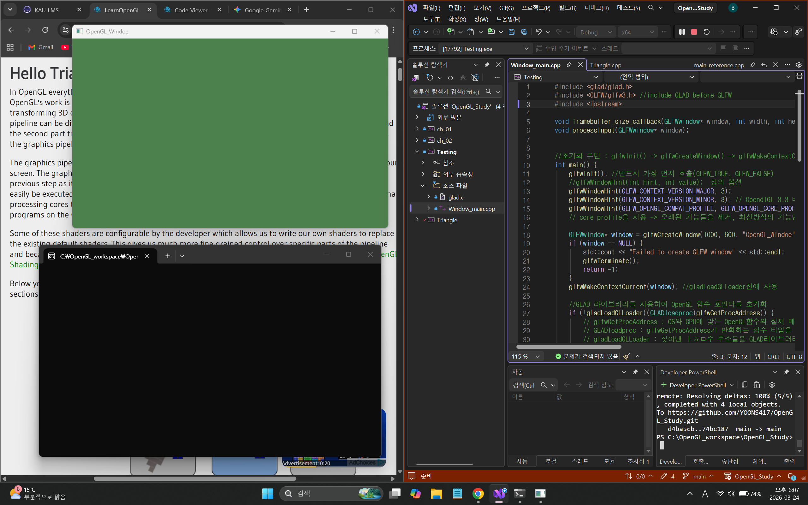
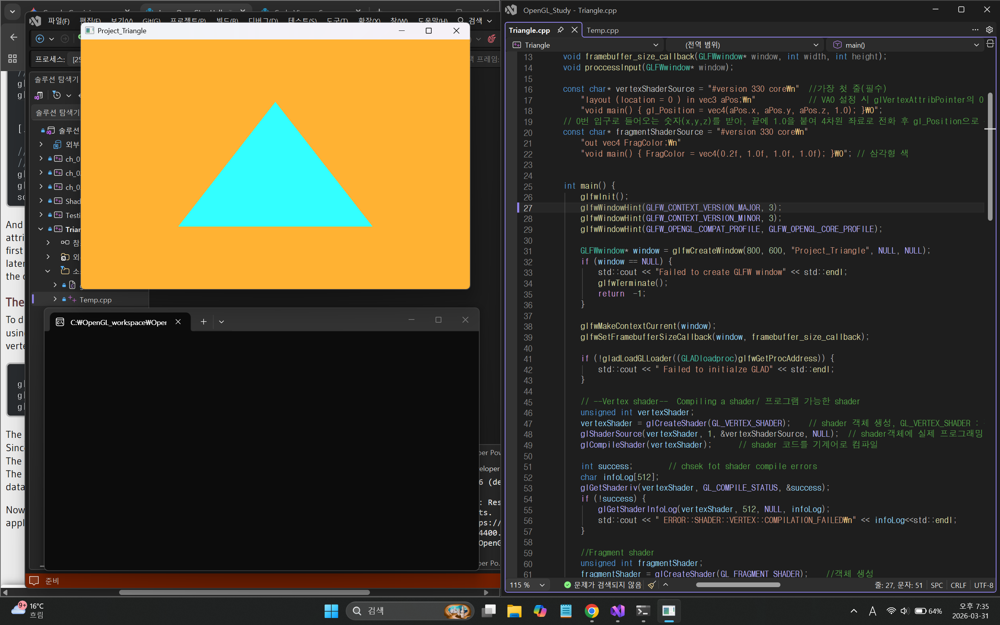
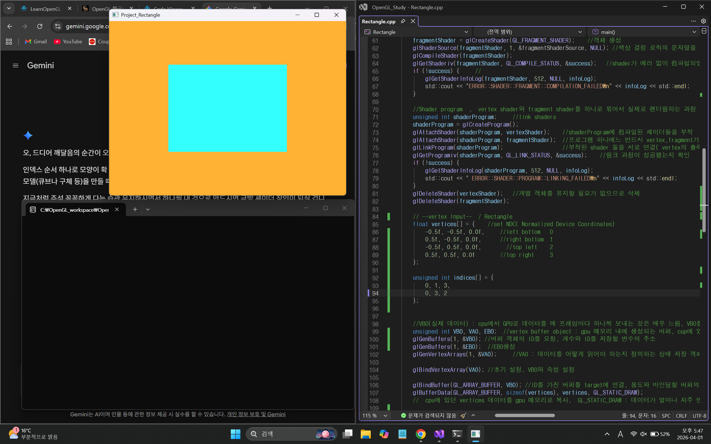
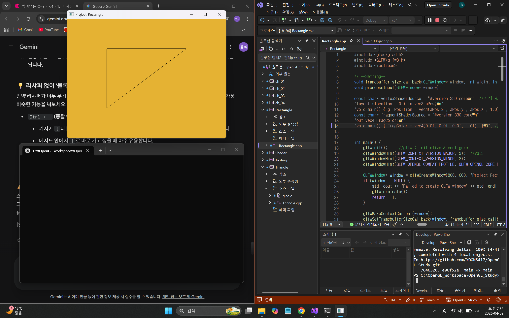
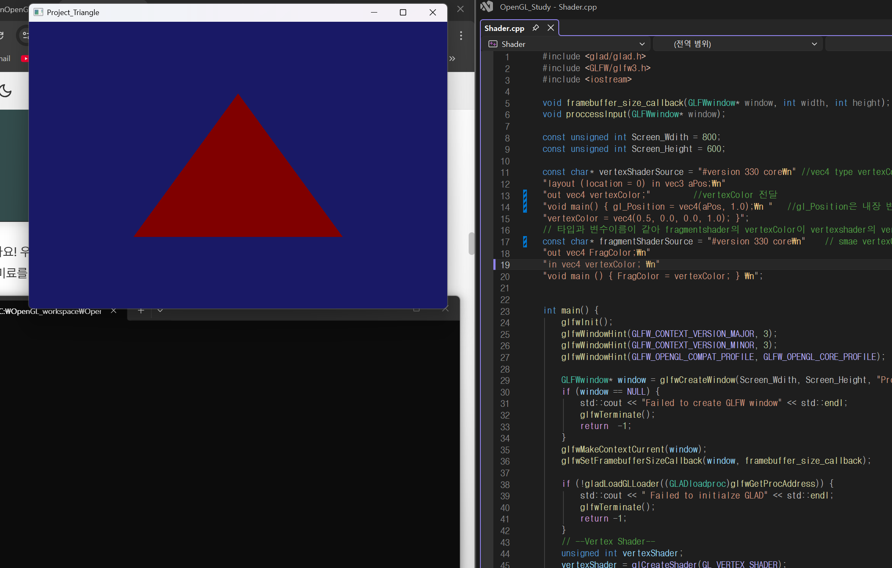
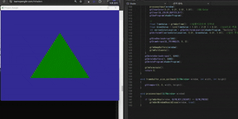
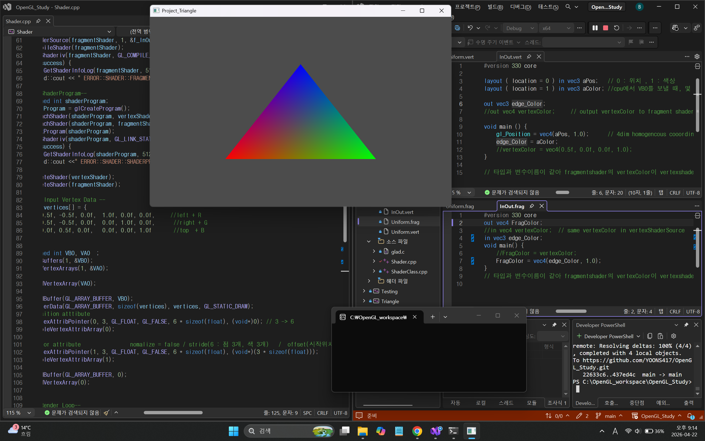
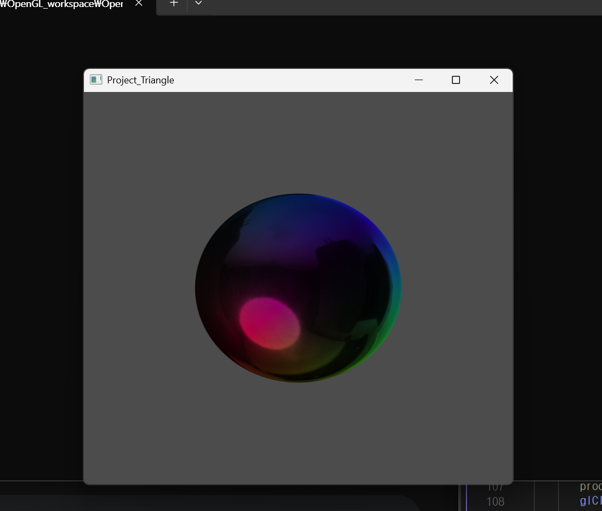
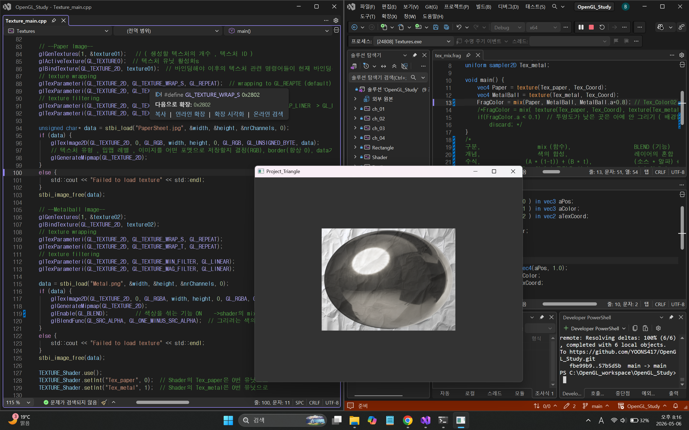

# 🎮 OpenGL Rendering Project

C++와 OpenGL을 사용하여 그래픽스 렌더링의 기초를 다지는 프로젝트 및 학습.
외부 설정 없이 바로 빌드하여 실행할 수 있도록 정적 라이브러리 구조로 설계.
* Vertex Data -> Buffer -> Shader -> Draw

## 🪜 학습 루트
1. 기본 렌더링
2. Shader + 색
3. Transform
4. Texture
5. Camera
6. Lighting
7. Shadow, Post Processing

## 📺 실행 화면

| 프로젝트명 | 실행 결과 | 설명 |
| :--- | :---: | :--- |
| **01. Testing** |  | 프로젝트 설정 및 라이브러리 로드 테스트, OpenGL Window 생성 |

<b> Ch 1 . 기본 렌더링 및 도형 출력 </b>

div id="ch1-table" markdown="1">
 
| **02. Triangle** |  | 기본적인 VAO/VBO를 이용한 삼각형 렌더링 (EBO X) |
| **02-1. Rectangle** |  | 기본적인 VAO/VBO/EBO를 이용한 사각형 렌더링 |
| **02-2. Wireframe Mode** |  | glPolygonMode를 사용한 Wireframe Mode |

| **03. Shader_GLSL** |  | GLSL에서 in&out을 사용해 shader에서 shader로 데이터 전달  |
| **03-1. Shader_uniform** |  | GLSL에서 uniform을 사용해 GPU shader로 데이터 전달 & 삼각형의 밝기 조절  |
| **03-2. Shader_vertices+edgecolor** |  | vertices Data에 color값을 넣고 각 모서리를 서로 다른 색 표현 / GLSL 분리  |
| **04. Texture** |  | 사각형에 Texture 입히기 & Mipmap, Filtering ,Blend로 투명화 |
| **04-1. Tex_Mix** |  | Blend 대신 Mix로 사각형에 Texture 2개 입히기  |
| **05. Transformation** |  | 렌더링된 사각형을 glm을 이용해 rotate |

## ✨ 주요 기능
- **GLFW/Glad**를 이용한 OpenGL 컨텍스트 설정
- **정적 라이브러리(.lib)** 포함을 통한 이식성 확보
- **Commons/Libraries/Projects** 구조화를 통한 깔끔한 프로젝트 관리

## 🛠 빌드 방법
1. 이 저장소를 복제합니다. `git clone https://github.com/YOONS417/OpenGL_Study.git`
2. `OpenGL_Study.sln` 파일을 Visual Studio로 엽니다.
3. `x64 / Debug` 또는 `Release` 모드에서 `F5`를 눌러 실행합니다.

## 📚 학습 내용
- OpenGL 파이프라인 이해
- 버퍼 객체(VBO, VAO) 관리 방법 학습
- 깃허브를 활용한 협업 및 버전 관리 기초 습득
- c++ 학습 및 포트폴리오

## 🚩최종 목표
* DirectX 11
